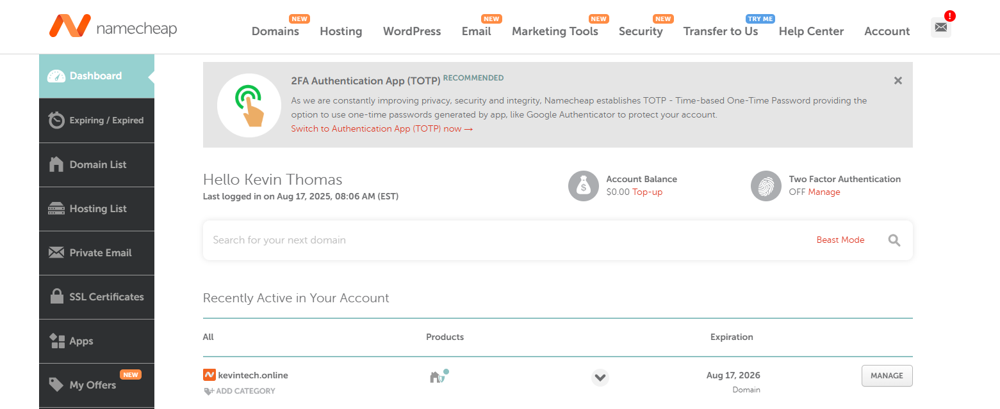
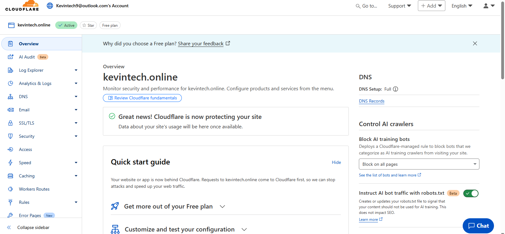

# 🚀 Cloud-Centric Organization with SOC Integration

This project demonstrates the design and deployment of a **cloud-centric organization** integrated with **SOC (Security Operations Center)** capabilities. It follows a hands-on lab approach, implementing Microsoft 365, Intune, Azure Sentinel, Defender, Terraform, and Cloudflare to build a secure, enterprise-like environment.

---

## 📌 Table of Contents

Click to expand

1. [Introduction](#introduction)
2. [Technologies Used](#technologies-used)
3. [Implementation Steps](#implementation-steps)
4. [Results](#results)
5. [Conclusion](#conclusion)

---

## Introduction
This lab simulates a **real-world enterprise environment** where:
- Cloud identity is managed via **Microsoft Entra/M365**
- Devices are managed using **Intune Autopilot**
- Security is enforced using **Defender (XDR, EDR, O365 protection)**
- SIEM/SOAR capabilities are implemented with **Azure Sentinel**
- Infrastructure automation is handled with **Terraform + GitHub**

[🔝 Back to Table of Contents](#-table-of-contents)

---

## Technologies Used
- 🌐 **Cloudflare Zero Trust**
- 💻 **Microsoft 365 / Entra ID / Intune**
- 🛡 **Microsoft Defender (O365, Endpoint, XDR)**
- 📊 **Azure Sentinel (SIEM + SOAR)**
- ⚙️ **Terraform + GitHub**
- ☁️ **Azure Virtual Machines**
- 📱 **Android/iOS device management**

[🔝 Back to Table of Contents](#-table-of-contents)

---

## Implementation Steps

Due to length, each step is summarized with screenshots arranged in gallery-style tables for clarity. Full details are available in the project PDF guide.

### Step 1 – Domain Purchase

*Custom domain purchased successfully.*

### Step 2 – Configure Cloudflare

*Cloudflare dashboard showing domain integration.*

### Step 3 – Microsoft 365 Tenant Setup
.png)
*Microsoft 365 tenant created successfully.*

### Step 4 – Custom Domain Integration
.png)
*Custom domain verification via Cloudflare.*

### Step 5 – Licensing

*License assignment in M365 Admin Center.*

... (Remaining steps continue in gallery-style format) ...

[🔝 Back to Table of Contents](#-table-of-contents)

---

## Results
- ✅ Domain integrated with Cloudflare + Microsoft 365
- ✅ Devices onboarded via Autopilot with policies
- ✅ Android secured with Work Profile & Intune
- ✅ Defender + Conditional Access protecting SaaS
- ✅ Azure Sentinel deployed & monitoring logs
- ✅ SOAR playbooks auto-mitigating brute force attacks

[🔝 Back to Table of Contents](#-table-of-contents)

---

## Conclusion
This lab successfully simulated an **enterprise-grade cloud-centric organization** with full SOC integration. It demonstrates hands-on skills in:
- Cloud Identity & Access Management
- Device Onboarding & Policy Automation
- Endpoint Protection & XDR
- SIEM & SOAR deployment with Azure Sentinel
- Infrastructure as Code with Terraform

📌 This project showcases **real-world cloud security and SOC implementation** skills suitable for enterprise environments.
